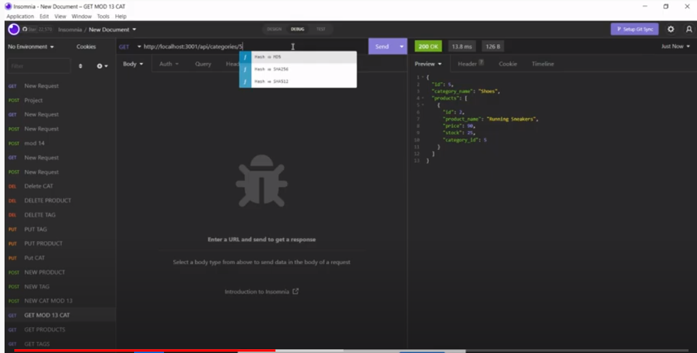

# Ecommerce Backend

This project is the model and api routes required to run a eccomerce site with products, categories, and tags.

## Languages
JS using express, sequelize

## Walkthrough

[Backend Walkthrough](https://youtu.be/KZDAIB3WGIU)

## Credits
U of T Bootcamp Template, Dawson Tilley